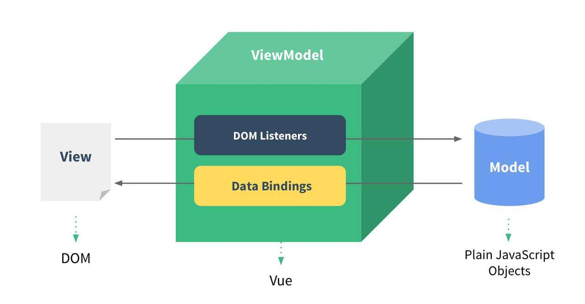
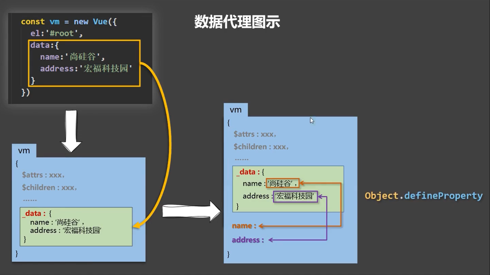
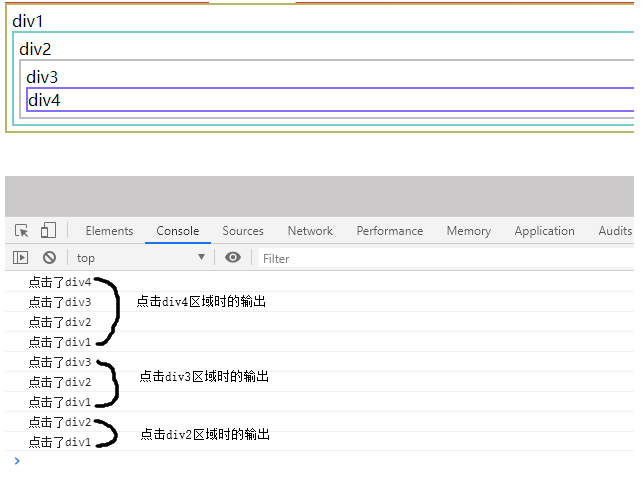

# Vue_learning
## 技术栈：
Vue、脚手架vue-cli、路由vue-Router、状态管理模式vuex、Axios、elementUI等ui框架和打包工具webpack等
  

此项目为Bilibili 尚硅谷Vue课程：https://www.bilibili.com/video/BV1Zy4y1K7SH/?spm_id_from=333.337.search-card.all.click  

代码和笔记为手敲，所以一些重复的内容已经被省略了，大致与课程一致。

update:从后续组件开始，需要搭建脚手架，所以代码按专题内容放在vue_learning_cli中。


***
**update** :2023/1/12: 第一次提交了代码。  

**update** :2023/2/1: 经历中间开发了一些爬虫工具，刷JS高级等事情，从1月12日开始耗时大约20天学到了网课第70节，制作todolist案例。此时需要插空系统学一下CSS和HTML的一些知识了。  
**update** :2023/2/7: 继续学习。  
**update** :2023/2/26:刷完vue2  

***
## vue2 技术复盘

### Q1：MVVM框架的理解？

- MVVM模型：
  - M：模型（Model），data中的数据
  - V：视图（View），模板代码
  - VM：视图模型（ViewModel），Vue实例
### Q2：和react的区别？
- 相同点：
  - 数据驱动视图
  - 组件化
  - Vue与React都使用了 Virtual DOM + Diff算法
- 不同点
  - 灵活易用的渐进式框架，进行数据拦截/代理，它对侦测数据的变化更敏感、更精确 。React推崇函数式编程（纯组件），数据不可变以及单向数据流
  - React推荐的做法是JSX + inline style, 也就是把 HTML 和 CSS 全都写进 JavaScript; Vue 推荐的做法是 template 的单文件组件格式。
- https://blog.csdn.net/m0_67401761/article/details/123399316
### Q3：插值语法和指令语法
- 插值语法：
  - 功能：用于解析标签体内容 ，写法：{{xxx}}，xxx是js表达式，且可以直接读取到data中的所有区域
- 指令语法： 
  - 功能：用于解析标签（包括：标签属性、标签体内容、绑定事件…）
  - 举例：< a v-bind:href="xxx">或简写为< a :href="xxx">，xxx同样要写js表达式，且可以直接读取到data中的所有属性
  - 备注：Vue中有很多的指令，且形式都是v-???，此处我们只是拿v-bind举个例子

### Q4: v-bind和v-model
- 单向绑定（v-bind）：数据只能从data流向页面
- 双向绑定（v-model）：数据不仅能从data流向页面，还可以从页面流向data
- 双向绑定一般都应用在表单类元素上（如：< input>、< select>、< textarea>等）
- v-model:value可以简写为v-model，因为v-model默认收集的就是value值

### Q5：el的两种写法
```javascript
// 写法1：
new Vue({
  el:'#root'
})
//写法2：挂载
vm.$mount('#root')
```
### Q6：data的两种写法
```javascript
// 写法1：对象式
data:{
  name:'JOJO'
}
```
```javascript
// 写法2：函数式（组件要用函数式）
data(){
  return{
    name:'JOJO'
  }
}
```
### Q7：数据代理

- Vue中的数据代理通过vm对象来代理data对象中属性的操作（读/写）
- Vue中数据代理的好处：更加方便的操作data中的数据
- 基本原理：
  - 通过object.defineProperty()把data对象中所有属性添加到vm上。
  - 为每一个添加到vm上的属性，都指定一个getter/setter。
  - 在getter/setter内部去操作（读/写）data中对应的属性。
### Q8：事件处理
- 使用v-on:xxx或@xxx绑定事件，其中xxx是事件名
- 事件的回调需要配置在methods对象中，最终会在vm上
- methods中配置的函数，==不要用箭头函数！==否则this就不是vm了
- methods中配置的函数，都是被Vue所管理的函数，this的指向是vm或组件实例对象
- @click="demo和@click="demo($event)"效果一致，但后者可以传参
```javascript
<button v-on:click="showInfo1">点我提示信息1</button>
<button @click="showInfo2($event,66)">点我提示信息2</button>

methods:{
  showInfo1(event){
    console.log(event)
  },
  showInfo2(evnet,num){
    console.log(event,num)
  }
}
```
### Q9：事件修饰符
- prevent：阻止默认事件（常用）
- stop：阻止事件冒泡（常用）
  - 【注】事件冒泡
    - 当我们点击页面某个元素时，会产生点击事件，事件由外到内，逐层递进,当目标元素捕捉到目标事件时，会响应事件，并由内到外，逐层往外传递.
    
- once：事件只触发一次（常用）
- capture：使用事件的捕获模式
  - 冒泡是从里往外冒，捕获是从外往里捕。
  - 当捕获存在时，先从外到里的捕获，剩下的从里到外的冒泡输出。
  - 参考博客：https://blog.csdn.net/catascdd/article/details/108273931
- self：只有event.target是当前操作的元素时才触发事件
- passive：事件的默认行为立即执行，无需等待事件回调执行完毕
  - passive主要用在移动端的scroll事件，来提高浏览器响应速度，提升用户体验。
  因为passive=true等于提前告诉了浏览器，touchstart和touchmove不会阻止默认事件，手刚开始触摸，浏览器就可以立刻给与响应；否则，手触摸屏幕了，但要等待touchstart和touchmove的结果，多了这一步，响应时间就长了，用户体验也就差了。

### Q10：键盘事件
```javascript
<input type="text" placeholder="按下回车提示输入" @keydown.enter="showInfo">
```
- Vue中常用的按键别名：
  - 回车：enter
  - 删除：delete (捕获“删除”和“退格”键)
  - 退出：esc
  - 空格：space
  - 换行：tab (特殊，必须配合keydown去使用)
  - 上：up
  - 下：down
  - 左：left
  - 右：right
- 注意：
  - 系统修饰键（用法特殊）：ctrl、alt、shift、meta
  - 配合keyup使用：按下修饰键的同时，再按下其他键，随后释放其他键，事件才被触发
  - 配合keydown使用：正常触发事件
  - 可以使用keyCode去指定具体的按键，比如：@keydown.13="showInfo"，但不推荐这样使用
  - Vue.config.keyCodes.自定义键名 = 键码，可以自定义按键别名

### Q11：计算属性
```html
姓：<input type="text" v-model="firstName"><br><br>
名：<input type="text" v-model="lastName"><br><br>
姓名：<span>{{fullName}}</span>
```
```javascript
//写法1：完整版
computed:{
  fullName:{
    get(){
      return this.firstName + '-' + this.lastName
    },
    set(value){
      const arr = value.split('-')
      this.firstName = arr[0]
      this.lastName = arr[1]
    }
  }
}
```
```javascript
//写法2：函数版（简写）
computed:{
    	fullName(){
		    return this.firstName + '-' + this.lastName
    	}
    }
```
总结：
- 定义：要用的属性不存在，需要通过已有属性计算得来。
- 原理：底层借助了Objcet.defineproperty()方法提供的getter和setter。
- get函数什么时候执行？
  - 初次读取时会执行一次
  - 当依赖的数据发生改变时会被再次调用
- 优势：与methods实现相比，内部有缓存机制（复用），效率更高，调试方便
- 备注：
  - 计算属性最终会出现在vm上，直接读取使用即可
  - 如果计算属性要被修改，那必须写set函数去响应修改，且set中要引起计算时依赖的数据发生改变
  - 如果计算属性确定不考虑修改，可以使用计算属性的简写形式

### Q12：监视属性
```html
<h2>今天天气好{{info}}!</h2>
<button @click="changeWeather">点击切换天气</button>
```
```javascript
// 写法1：
new Vue({
            el:'#root', 
            data:{ 
                isHot:true,
            },
            // 根据isHot的bool值决定显示什么文字
            computed:{
                info(){
                    return this.isHot ? '炎热' : '凉爽' 
                }
            },
            // 按钮点击改变isHot的值
            methods:{
				changeWeather(){
					this.isHot = !this.isHot
				}
			},
            // 监视isHot的值，要是改变了就输出
            watch:{
                isHot:{
                        immediate:true, //初始化时让handler调用一下
                        //handler什么时候调用？当isHot发生改变时
                        handler(newValue,oldValue){
                        console.log('isHot被修改了',newValue,oldValue)
                      }
                }
            }
        })
```
总结：
- 当被监视的属性变化时，回调函数自动调用，进行相关操作
- 监视的属性必须存在，才能进行监视
- 监视有两种写法：
- 创建Vue时传入watch配置

通过vm.$watch监视
```javascript
// 写法2：
vm.$watch('isHot',{
	immediate:true,
	handler(newValue,oldValue){
		console.log('isHot被修改了',newValue,oldValue)
	}
})
```
```javascript
// 写法3：简写。如果监视属性除了handler没有其他配置项的话，可以进行简写。
isHot(newValue,oldValue){
    console.log('isHot被修改了',newValue,oldValue,this)
}
```
### Q13：深度监视
```html
<h3>a的值是:{{numbers.a}}</h3>
<button @click="numbers.a++">点我让a+1</button>
<h3>b的值是:{{numbers.b}}</h3>
<button @click="numbers.b++">点我让b+1</button>
```
```javascript
new Vue({
            el:'#root', 
            data:{ 
                isHot:true,
                numbers:{
                    a:1,
                    b:1,
                }
            },
            watch:{
                //监视多级结构中所有属性的变化
                numbers:{
                    deep:true,
                    handler(){
                        console.log('numbers改变了')
                    }
                },
              
              //监视多级结构中某个属性的变化
              'numbers.a':{
                  handler(){
                      console.log('a被改变了')
                  }
              } 
            }
        })
```
总结：
- Vue中的watch默认不监测对象内部值的改变（一层）
- 在watch中配置deep:true可以监测对象内部值的改变（多层）

### Q14：computed和watch的不同
- 功能上：computed是计算属性，watch是监听一个值的变化，然后执行对应的回调。
- 是否调用缓存：computed中的函数所依赖的属性没有发生变化，那么调用当前的函数的时候会从缓存中读取，而watch在每次监听的值发生变化的时候都会执行回调。
- 是否调用return：computed中的函数必须要用return返回，watch中的函数不是必须要用return。
- computed默认第一次加载的时候就开始监听；watch默认第一次加载不做监听，如果需要第一次加载做监听，添加immediate属性，设置为true（immediate:true）
https://blog.csdn.net/web22050702/article/details/125530363


